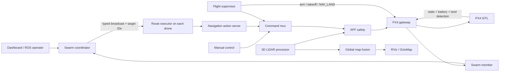

# VTOL APF Swarm Navigation

ROS 2 Jazzy and PX4 SITL project for controlling a three-drone VTOL swarm in
Gazebo. The system combines per-drone navigation, 3D Artificial Potential
Field (APF) obstacle avoidance, dynamic route assignment, battery-aware safety,
a browser dashboard, global OctoMap fusion, camera/gimbal control, and Optuna
parameter tuning.

The recommended way to run the complete simulation is Docker Compose. The
container image pins PX4, `px4_msgs`, Micro XRCE-DDS Agent, ROS/Gazebo, and the
Python optimization dependencies, so another Linux machine can reproduce the
same runtime without installing those components separately.

> This is simulation and research software. Validate every safety behavior in
> SITL before connecting it to real hardware. `FORCE DISARM` stops motors
> immediately and can cause a crash if used in flight.

## What is included

- Three independent PX4 SITL VTOL vehicles, XRCE agents, ROS namespaces, and
  sensor/control stacks.
- A local browser dashboard for fleet state, mission planning, APF telemetry,
  nominal/flown paths, cameras, gimbals, snapshots, and recordings.
- Dynamic swarm membership with registration, heartbeats, leases, health
  checks, and duplicate-ID protection.
- Multi-drone route assignment that balances completion time and accounts for
  heading, vertical travel, VTOL transitions, route changes, battery time,
  energy, and return-home reserve.
- Per-drone typed commands. `ARM`, `TAKEOFF`, `HOME`, `LAND`, speed, LiDAR range,
  `OFF`, and `FORCE DISARM` are filtered by drone ID instead of being applied
  accidentally to every vehicle.
- A strict command chain in which `px4_gateway_node` is the only node that
  publishes to PX4 `/fmu/in/*` topics.
- PX4-owned landing: ROS cancels the selected route and sends one
  `VEHICLE_CMD_NAV_LAND`; PX4 performs the VTOL transition, descent, touchdown
  detection, and normal disarm.
- An `ARM` requirement before `TAKEOFF`, active-LAND command blocking, and an
  explicit emergency `FORCE DISARM` path.
- 3D LiDAR processing and APF avoidance with a speed-dependent active obstacle
  sector and an omnidirectional emergency radius.
- One global plus N local OctoMaps with cross-drone free-ray clearing,
  temporal obstacle expiry, and persistent static-geometry confirmation.
- Optuna single-goal and three-goal optimization, isolated parallel workers,
  repeatability benchmarks, SQLite studies, reports, and exact trial replay.
- Docker profiles for headless software rendering, NVIDIA, Intel/AMD direct
  rendering, X11 Gazebo/RViz, and bind-mounted development.

## System architecture



The important ownership rule is:

```text
operator -> coordinator -> matching route executor -> flight/navigation layer
         -> command mux -> APF safety -> PX4 gateway -> PX4
```

The browser never commands PX4 directly. It makes typed HTTP requests to the
dashboard ROS node, and the coordinator remains the owner of targets, routes,
cancellation, HOME, and fleet-level flight commands.

## Repository layout

| Path | Purpose |
| --- | --- |
| `drone_interfaces/` | Shared ROS messages, services, and actions. |
| `drone_control/` | Flight supervisor, PX4 gateway, manual/automated control, gimbal control, and vehicle TF. |
| `drone_navigation/` | Navigation action server, route executor, command mux, LiDAR processing, APF safety, and path visualization. |
| `drone_swarm/` | Coordinator, membership, routing/cost models, gimbal router, operator terminal, and global map fusion. |
| `drone_dashboard/` | ROS-to-HTTP server and dependency-free browser UI. |
| `drone_description/` | VTOL model, URDF/xacro, sensors, and RViz configurations. |
| `drone_bringup/` | Local, swarm, onboard, simulation, and RViz launch files; Gazebo worlds; PX4 patches. |
| `apf_optuna/` | Trial orchestration, scoring, study preparation, and benchmark reports. |
| `scripts/` | Optuna worker/replay/benchmark scripts and Raspberry Pi build helper. |
| `docker/` | Reproducible image, runtime entrypoint, and development rebuild helper. |
| `docs/` | Detailed architecture and Docker notes. |

## Quick start with Docker

### Requirements

- A Linux host with Docker Engine and the Docker Compose plugin.
- Internet access for the first image build.
- Enough free memory and disk for ROS, PX4, Gazebo, and three sensor-equipped
  vehicles. `BUILD_JOBS=2` is intentionally conservative.
- For NVIDIA acceleration: a working host NVIDIA driver and NVIDIA Container
  Toolkit.
- For visible Gazebo and RViz windows: a local X11/XWayland session.

Check the basic tools before cloning:

```bash
docker --version
docker compose version
nvidia-smi  # NVIDIA profile only
```

Clone the GitHub branch that contains the complete swarm and Docker workflow:

```bash
git clone --branch vtol-apf-swarm --single-branch \
  https://github.com/dgkagkan/drone-apf-navigation.git
cd drone-apf-navigation
cp .env.example .env
```

### Headless simulation

The portable default uses Mesa software rendering and does not open Gazebo or
RViz windows:

```bash
docker compose up --build
```

On an NVIDIA machine, use the GPU profile:

```bash
docker compose -f compose.yaml -f compose.nvidia.yaml up --build
```

Wait until the dashboard service is healthy, then open:

<http://127.0.0.1:8765>

The first build is much slower than later starts because it downloads and
compiles PX4, Micro XRCE-DDS Agent, `px4_msgs`, and the ROS workspace. Follow
startup progress with:

```bash
docker compose ps
docker compose logs -f swarm-sim
```

Press `Ctrl+C` in the Compose terminal and stop the stack with:

```bash
docker compose down
```

`docker compose down` does not delete the source tree or the host snapshot and
recording folders.

### Open Gazebo and RViz with NVIDIA

Stop an existing headless stack before changing profiles:

```bash
docker compose down
xhost +si:localuser:$(id -un)
docker compose \
  -f compose.yaml \
  -f compose.gui.yaml \
  -f compose.nvidia.yaml \
  up --build
```

After stopping the GUI stack, revoke the temporary X11 permission:

```bash
xhost -si:localuser:$(id -un)
```

For Intel or AMD graphics, replace `compose.nvidia.yaml` with
`compose.gpu.yaml`. Set `RENDER_GID` in `.env` to the numeric host render-group
ID when it is not `109`:

```bash
getent group render
```

### Docker profiles at a glance

| Command/overlay | Gazebo/RViz windows | Rendering | Source edits live-mounted |
| --- | --- | --- | --- |
| `compose.yaml` | No | Mesa software/EGL headless | No |
| `+ compose.nvidia.yaml` | No | NVIDIA/EGL headless | No |
| `+ compose.gpu.yaml` | No | Intel/AMD `/dev/dri` | No |
| `+ compose.gui.yaml` | Yes | Combine with the correct GPU overlay | No |
| `+ compose.dev.yaml` | Depends on GUI overlay | Depends on GPU overlay | Yes |

### Environment settings

Edit `.env` before starting Compose:

| Variable | Default | Meaning |
| --- | --- | --- |
| `LOCAL_UID`, `LOCAL_GID` | `1000` | Host ownership used for bind-mounted media and development files. |
| `DASHBOARD_BIND_ADDRESS` | `127.0.0.1` | Host interface that exposes the dashboard. |
| `DASHBOARD_PORT` | `8765` | Host dashboard port. |
| `DASHBOARD_RATE_HZ` | `60.0` | Dashboard ROS request/state and maximum camera-processing rate. Actual camera FPS remains source-limited. |
| `ROS_DOMAIN_ID` | `0` | ROS domain used by the complete stack. |
| `PHOTO_DIR` | `./docker-data/photos` | Host directory mounted at `/data/photos`. |
| `RECORD_DIR` | `./docker-data/recordings` | Host directory mounted at `/data/recordings`. |
| `BUILD_JOBS` | `2` | Parallel image-build jobs; lower this if RAM is limited. |
| `RENDER_GID` | `109` | Host render-group ID for the Intel/AMD profile. |

The dashboard has no authentication. Keep `DASHBOARD_BIND_ADDRESS=127.0.0.1`
unless the machine is on a trusted isolated network.

## Dashboard workflow

The normal mission sequence is:

1. Wait for `Coordinator online` and for all expected drone cards to become
   connected/localized.
2. Press `ARM ALL`, or arm only the required drone.
3. Press `TAKEOFF ALL`, or take off the required drone. TAKEOFF is rejected if
   the selected vehicle has not been armed first.
4. Add map targets. Every target stores its altitude, cruise speed, and
   multicopter/fixed-wing choice.
5. Press `CALCULATE`. This only creates and displays a route preview; it does
   not move a drone.
6. Inspect the assignments and press `START MISSION` to dispatch them.
7. Use `RECALCULATE` after targets or the healthy fleet change. Use `CANCEL` to
   stop the active mission and recover unfinished work.

Per-drone speed overrides and LiDAR ranges are also routed by ID. `AUTO` removes
a speed override and returns to each route target's stored speed.

### HOME, LAND, and FORCE DISARM

- Normal `HOME` returns the selected drone to its recorded spawn X/Y at the
  configured safe altitude. It finishes in multicopter mode and holds there.
  It does **not** issue LAND.
- `HOME ALL` creates a separate targeted HOME route for every eligible drone.
  Each route executor ignores routes whose `drone_id` is different from its
  own.
- Low-battery RTH is intentionally different: after reaching home, the local
  battery safety path issues LAND.
- `LAND` preempts only the selected drone's route and publishes a local flight
  request. The supervisor sends PX4 `VEHICLE_CMD_NAV_LAND` at the current
  position and waits for PX4 to confirm both touchdown and disarm.
- While PX4 LAND is active, conflicting flight commands are rejected. After a
  successful landing, press `ARM` and then `TAKEOFF`; TAKEOFF no longer arms a
  vehicle implicitly.
- `FORCE DISARM` sends PX4's forced motor-stop command. Use it only when normal
  touchdown detection is stuck and the vehicle is known to be safely on the
  ground, or for an actual emergency.

### Cameras, snapshots, and recordings

Each camera card has independent `SNAPSHOT` and `RECORD/STOP` controls. Media
is grouped into a subdirectory for each drone:

```text
docker-data/photos/drone_1/snapshot_YYYYMMDD_HHMMSS_microseconds.jpg
docker-data/recordings/drone_1/recording_YYYYMMDD_HHMMSS_microseconds.avi
```

In Docker, select host storage by setting `PHOTO_DIR` and `RECORD_DIR` in
`.env`. Compose mounts them into the container and preconfigures the dashboard,
so capture controls are enabled at startup. A browser cannot directly grant a
container arbitrary access to host folders.

In a native run, the storage panel at the bottom of the dashboard can open the
computer's native folder picker through `zenity` or `kdialog`. Photo and video
folders are selected separately; their capture controls stay disabled until
the corresponding folder is configured.

A recording file is finalized atomically when `STOP` is pressed. Recording can
start only while a fresh camera frame exists, and stopping reports an error if
no frames arrived during the recording.

## Develop inside Docker

The normal image contains a snapshot of the source from build time. Rebuild it
after changing project files:

```bash
docker compose up --build
```

For frequent edits, use the development overlay. It bind-mounts the checkout
and stores `build`, `install`, and `log` in named Docker volumes:

```bash
docker compose \
  -f compose.yaml \
  -f compose.dev.yaml \
  -f compose.nvidia.yaml \
  up --build
```

After changing C++ or Python code:

```bash
docker compose exec swarm-sim drone-dev-build
docker compose \
  -f compose.yaml \
  -f compose.dev.yaml \
  -f compose.nvidia.yaml \
  restart swarm-sim
```

HTML, CSS, and JavaScript are symlink-installed in development mode, so a hard
browser refresh is normally enough after a web-only change. Rebuild the image
when `docker/Dockerfile`, system dependencies, pinned dependency commits, PX4
patches, or Docker scripts change.

## Native ROS 2 installation

Docker is the shortest reproducible path. A native installation is useful for
development, hardware integration, and the existing Optuna scripts. The tested
layout expected by the launch files is:

```text
~/ros2_work_ws/src/drone-apf-navigation
~/ros2_work_ws/src/px4_msgs
~/drone_project/PX4-Autopilot
~/drone_project/Micro-XRCE-DDS-Agent/build/MicroXRCEAgent
```

Install Ubuntu 24.04, ROS 2 Jazzy Desktop, Gazebo Harmonic/`ros_gz`, the ROS
build tools, `git`, `cmake`, `python3-venv`, and `jq`. Source ROS before all
build commands:

```bash
source /opt/ros/jazzy/setup.bash
```

### 1. Clone this repository and `px4_msgs`

```bash
mkdir -p ~/ros2_work_ws/src
cd ~/ros2_work_ws/src
git clone --branch vtol-apf-swarm --single-branch \
  https://github.com/dgkagkan/drone-apf-navigation.git
git clone https://github.com/PX4/px4_msgs.git
git -C px4_msgs checkout ff7ae284c4b9cb1c39d182e9f1a1343b3817011e
```

### 2. Build the pinned PX4 checkout

```bash
mkdir -p ~/drone_project
cd ~/drone_project
git clone https://github.com/PX4/PX4-Autopilot.git
git -C PX4-Autopilot checkout 7ab709c2029a1a2c945be08d53eae1097a7aa47f
git -C PX4-Autopilot submodule update --init --recursive
cd PX4-Autopilot
bash Tools/setup/ubuntu.sh --no-nuttx

git apply ~/ros2_work_ws/src/drone-apf-navigation/drone_bringup/px4/0001-offboard-fixed-wing-speed.patch
git apply ~/ros2_work_ws/src/drone-apf-navigation/drone_bringup/px4/0002-load-based-battery-simulator.patch
git apply --unidiff-zero \
  ~/ros2_work_ws/src/drone-apf-navigation/drone_bringup/px4/0003-gazebo-headless-rendering.patch

install -m 0755 \
  ~/ros2_work_ws/src/drone-apf-navigation/drone_bringup/px4/4030_gz_standard_vtol_lidar \
  ROMFS/px4fmu_common/init.d-posix/airframes/4030_gz_standard_vtol_lidar
sed -i '/4004_gz_standard_vtol/a 4030_gz_standard_vtol_lidar' \
  ROMFS/px4fmu_common/init.d-posix/airframes/CMakeLists.txt
make -j2 px4_sitl_default
```

Apply the three patches and insert the custom airframe only once per clean PX4
checkout. Their purpose is documented in
[`drone_bringup/px4/README.md`](drone_bringup/px4/README.md).

### 3. Build Micro XRCE-DDS Agent

```bash
cd ~/drone_project
git clone https://github.com/eProsima/Micro-XRCE-DDS-Agent.git
git -C Micro-XRCE-DDS-Agent checkout 73622810d984349b80bbac0ef55fc0b694d62222
cmake -S Micro-XRCE-DDS-Agent -B Micro-XRCE-DDS-Agent/build \
  -DCMAKE_BUILD_TYPE=Release -DUAGENT_BUILD_TESTS=OFF
cmake --build Micro-XRCE-DDS-Agent/build --parallel 2
```

### 4. Install ROS dependencies and build the workspace

Run `rosdep init` once on a new ROS installation if it has not already been
initialized.

```bash
source /opt/ros/jazzy/setup.bash
cd ~/ros2_work_ws
rosdep update
rosdep install --from-paths src --ignore-src --rosdistro jazzy -r -y
colcon build --symlink-install
source install/setup.bash
```

### 5. Run the complete native simulation

This command opens Gazebo, RViz, and the dashboard by default:

```bash
source /opt/ros/jazzy/setup.bash
source ~/ros2_work_ws/install/setup.bash
ros2 launch drone_bringup swarm_sim.launch.py world:=test
```

Useful variants:

```bash
# Headless smoke test
ros2 launch drone_bringup swarm_sim.launch.py \
  world:=test headless:=true use_rviz:=false open_dashboard:=false

# Dashboard/coordinator only; no PX4 or Gazebo
ros2 launch drone_bringup swarm.launch.py open_dashboard:=false

# Enable the interactive swarm terminal as well
ros2 launch drone_bringup swarm_sim.launch.py operator_terminal:=true
```

The default local three-drone layout is:

| Drone | PX4 instance | MAV system ID | XRCE UDP port | Initial ENU position |
| --- | ---: | ---: | ---: | --- |
| `drone_1` | 0 | 1 | 8888 | `(0, 0, 0)` |
| `drone_2` | 1 | 2 | 8889 | `(0, 8, 0)` |
| `drone_3` | 2 | 3 | 8890 | `(0, -8, 0)` |

## ROS command examples

The coordinator service is the preferred operator API because it updates route
ownership and sends a targeted typed command:

```bash
# ARM only drone_2
ros2 service call /swarm/command drone_interfaces/srv/SwarmCommand \
  "{command: 11, drone_id: drone_2}"

# TAKEOFF only drone_2 to 15 m at 2 m/s; ARM must already be complete
ros2 service call /swarm/command drone_interfaces/srv/SwarmCommand \
  "{command: 12, drone_id: drone_2, takeoff_altitude_m: 15.0, takeoff_climb_speed_m_s: 2.0}"

# HOME only drone_2; no automatic LAND
ros2 service call /swarm/command drone_interfaces/srv/SwarmCommand \
  "{command: 4, drone_id: drone_2}"

# LAND only drone_2
ros2 service call /swarm/command drone_interfaces/srv/SwarmCommand \
  "{command: 7, drone_id: drone_2}"

# Emergency motor stop for drone_2
ros2 service call /swarm/command drone_interfaces/srv/SwarmCommand \
  "{command: 14, drone_id: drone_2}"
```

An empty `drone_id` targets all eligible drones for commands that support an
ALL operation. The numeric constants are defined in
[`drone_interfaces/srv/SwarmCommand.srv`](drone_interfaces/srv/SwarmCommand.srv).

For low-level diagnosis, a local flight request can bypass the coordinator and
reach one namespaced supervisor:

```bash
ros2 topic pub --once /drone_2/flight/request \
  drone_interfaces/msg/FlightRequest \
  "{header: {frame_id: map}, request: 3}"
```

Use this only for diagnosis; it does not perform the coordinator's route/task
bookkeeping.

Useful state checks:

```bash
ros2 topic echo /drone_1/vehicle/state --once
ros2 topic echo /drone_1/fmu/out/vehicle_status_v4 --once
ros2 topic echo /drone_1/fmu/out/vehicle_land_detected --once
ros2 topic hz /drone_1/gimbal_camera
```

Inside the production container, source the installed workspace explicitly for
one-off diagnostics:

```bash
docker compose exec swarm-sim bash -lc \
  'source /opt/ros/jazzy/setup.bash && source /opt/px4_msgs_ws/install/setup.bash && source /opt/drone_ws/install/setup.bash && ros2 topic list'
```

## APF obstacle avoidance

The APF layer is shared by manual, autonomous, and swarm navigation. It does
not replace the selected command source; it modifies that intent only when
fresh obstacle data requires avoidance.

The LiDAR processor transforms and filters the point cloud into the `map`
frame. The APF safety node selects points from the shortest angular sector
between measured horizontal velocity and the original movement intent. The
sector margin grows with speed. Obstacles inside `emergency_radius` bypass the
sector filter and remain active from every direction.

Important configuration is in
[`drone_control/config/controller.yaml`](drone_control/config/controller.yaml),
including influence/trigger distances, attractive and repulsive gains,
fixed-wing turn and pitch limits, trail widths, sector margins, emergency
radius, geofence, and speed limits. Preset overrides are stored in:

- `drone_navigation/config/apf_modes/normal.yaml`
- `drone_navigation/config/apf_modes/stable.yaml`
- `drone_navigation/config/apf_modes/sport.yaml`

Runtime diagnostics include `/apf/telemetry`, `/apf/obstacles_used`, and
`/apf/obstacles_sector_ignored` inside each drone namespace.

## Swarm routing and battery safety

Submitting a target only appends it to `pending_targets`. `CALCULATE` and
`RECALCULATE` build a preview over the current healthy-drone snapshot. Drones
move only after `START MISSION` publishes a versioned broadcast and all selected
route executors acknowledge their own route.

The solver first seeds drone-to-target assignments, inserts remaining targets,
then runs route improvement passes. Its objective prioritizes the longest
completion time, then route spread, then total swarm cost. A target appears in
exactly one route. Estimated time and energy include movement, turns, vertical
travel, APF detour factors, VTOL transitions, route-change penalties, and the
configured return-home reserves.

Battery safety also runs locally in `swarm_member_node`:

- Low battery adds a routing penalty.
- Critical battery excludes the drone from new work, recovers unfinished
  targets, and requests RTH. If the coordinator does not acknowledge it, the
  onboard node sends its own HOME goal.
- Emergency battery sends local LAND.
- The safety latch clears only while disarmed and above the recovery threshold.

Defaults are in
[`drone_swarm/config/swarm.yaml`](drone_swarm/config/swarm.yaml).

## Global mapping

Every connected LiDAR drone publishes a typed low-rate map cloud. The PC-side
`swarm_global_map_server` keeps one complete probabilistic local OctoMap per
drone and fuses every drone's hit/miss rays into one global map. Occupied voxels
persist until repeated verified free rays clear them. Missing observations are
not treated as free space, so sparsely sampled surfaces such as the floor remain
mapped. A single noisy miss does not toggle local occupancy and its overlay color.
Clearing applies to every obstacle, not only other drones. It publishes:

- `/swarm/octomap_point_cloud_centers`
- `/swarm/octomap_binary`
- `/swarm/octomap_full`
- `/swarm/mapping/<drone_id>/occupied_voxels`

RViz shows `/swarm/mapping_visualization`, with the same global geometry colored
by height and per-drone local colors replacing matching voxels. Colors are assigned
as drones join; overlapping locals use drone-ID order for a stable result.
For height colors without local overlays, disable `Global OctoMap with local colors`
and enable `Global OctoMap only (height)`. The combined display uses a fixed
blue–cyan–green–yellow–red height scale from -1 to 60 m, configurable through the
mapper parameters `visualization_min_z_m` and `visualization_max_z_m`. Fixed bounds
prevent recoloring existing voxels as the map grows. These are visualization options; the global
OctoMap messages and clearing behavior do not depend on the selected display.

`dynamic_obstacle_timeout_sec` defaults to `0` (evidence-based clearing).
Setting a positive value enables the optional temporal mode: unconfirmed hits
expire when unseen, while `static_confirmation_sec` (8) and
`static_confirmation_hits` (12) control promotion to persistent geometry.
Short timeouts can erase sparse floor returns and cause local-color flicker.
Both modes use probabilities `hit=0.70`, `miss=0.35`, and `max=0.90`;
at most four newer miss observations clear a saturated persistent voxel when
there are no intervening hits. Unobserved obstacles are retained in the default
mode until a sensor actually sees through their old location.

The mapping input is the main 360-degree LiDAR with vertical coverage of only
±15 degrees, not the downward landing sensor. No artificial ground plane is
inserted: the floor is mapped only where actual rays hit it, not directly below
the drone where this sensor has a blind region.

Mapping is enabled by default. In Docker, set `DRONE_USE_MAPPING=false` in
`.env` only when a lighter run is more important than the global map.

## Optuna APF optimization

The optimizer starts a fresh PX4/Gazebo simulation for every trial, runs the
same automated APF control path, evaluates the trajectory against collision
geometry in `optuna_course.sdf`, and stores the study in SQLite WAL mode.
Non-APF startup failures can be retried and are excluded from parameter
scoring.

For the current native scripts, first create the repository-local environment:

```bash
cd ~/ros2_work_ws/src/drone-apf-navigation
python3 -m venv .venv
source .venv/bin/activate
python -m pip install --upgrade pip
python -m pip install -r requirements-optuna.txt
source /opt/ros/jazzy/setup.bash
source ~/ros2_work_ws/install/setup.bash
```

Close every existing PX4, Gazebo, controller, or optimizer process before a
single-worker run:

```bash
# Five visible single-goal trials
python -m apf_optuna.optimizer --trials 5

# One hundred unattended single-goal trials
python -m apf_optuna.optimizer --trials 100 --headless

# Four isolated workers; argument is trials per worker
./scripts/run_4_headless.sh 25

# Four isolated workers on the three-goal mission
./scripts/run_4_three_goal_headless.sh 25

# Visible three-goal run seeded with controller.yaml values
./scripts/run_three_goal_gui.sh 1
```

Results go to `optuna_results/` by default and are intentionally ignored by
Git. Each `trial_XXXXX/` contains `result.json`, attempt summaries, ROS logs,
simulation logs, and controller logs. Inspect a study with:

```bash
optuna-dashboard sqlite:///optuna_results/study.db
```

Then open <http://127.0.0.1:8080>.

Replay a stored trial with its exact parameters:

```bash
./scripts/replay_trial_gui.sh 4 optuna_results/apf_1000_v2
```

The repeatability scripts select top candidates and rerun them multiple times:

```bash
./scripts/run_top10_stability.sh
./scripts/run_top23_three_goal_stability.sh
```

See [`apf_optuna/README.md`](apf_optuna/README.md) for the shorter optimizer
reference and script argument details.

## Raspberry Pi / onboard brain

`drone_brain.launch.py` starts a single namespaced control brain without PX4
SITL, Gazebo, RViz, or a coordinator. `add_sim_vehicle.launch.py` can keep PX4,
Gazebo, sensor rendering, and the XRCE agent on the main PC while APF and
navigation run on a remote onboard computer over direct Ethernet.

The reduced-memory onboard build is:

```bash
cd ~/ros2_ws/src/drone-apf-navigation
./scripts/build_drone_brain.sh
source ~/ros2_ws/install/onboard/setup.bash
```

The PC and onboard machine must use the same ROS domain, compatible Fast DDS
profiles, unique drone/system IDs, and the same `map` frame. The current LAN
profiles name `enp12s0` on the PC and `eth0` on the Pi; update
`drone_bringup/config/fastdds_ethernet_*.xml` if the interfaces differ. Full
commands are documented in [`docs/architecture.md`](docs/architecture.md).

## Build and test

Run all repository package builds and tests from the workspace root:

```bash
source /opt/ros/jazzy/setup.bash
cd ~/ros2_work_ws
colcon build --symlink-install
source install/setup.bash
colcon test --event-handlers console_direct+
colcon test-result --verbose
```

Optuna's Python tests require the repository virtual environment:

```bash
cd ~/ros2_work_ws/src/drone-apf-navigation
source .venv/bin/activate
python -m pytest apf_optuna/test
```

Generated `build/`, `install/`, `log/`, `.venv/`, `.env`, Optuna results, and
captured media are excluded from Git. Source, launch/configuration files, PX4
patches, Docker files, Optuna code, and operational scripts are versioned.

## Troubleshooting

### `http://127.0.0.1:8765` does not connect

The dashboard starts after the simulation processes, and the first image build
can take a long time. Check:

```bash
docker compose ps
docker compose logs --tail=200 swarm-sim
```

If another process already owns port 8765, change `DASHBOARD_PORT` in `.env`.

### Gazebo or RViz does not appear

The base Docker profile is intentionally headless. Use `compose.gui.yaml` plus
the correct GPU overlay and grant X11 access with the commands in the Docker
GUI section. A native `swarm_sim.launch.py` run opens both by default.

### Simulation runs much slower than real time

Confirm that only one swarm stack is running, use the NVIDIA or Intel/AMD GPU
overlay, and inspect host CPU/GPU/memory pressure. RViz, global mapping, three
cameras, and three LiDAR sensors all add load. A headless GPU run is the
lightest complete sensor configuration.

### Source changes do not appear in Docker

The normal image does not live-mount the checkout. Run `docker compose up
--build`, or use `compose.dev.yaml`, run `drone-dev-build`, and restart the
service. Hard-refresh the browser after dashboard asset changes.

### Camera FPS falls and the preview disappears

Check the ROS camera topic and container logs. The dashboard removes a camera
from the live list after three seconds without a fresh frame:

```bash
ros2 topic hz /drone_1/gimbal_camera
docker compose logs --tail=200 swarm-sim
```

Use GPU rendering when available and avoid running multiple Gazebo instances.
The Compose service already allocates a 2 GB shared-memory segment.

### LAND remains active after touchdown

PX4 must set `vehicle_land_detected.landed=true` and then disarm. Inspect:

```bash
ros2 topic echo /drone_1/fmu/out/vehicle_land_detected --once
ros2 topic echo /drone_1/fmu/out/vehicle_status_v4 --once
```

If PX4 does not confirm touchdown, the supervisor intentionally keeps LAND
active and blocks TAKEOFF or route commands. Use `FORCE DISARM` only after
visually confirming that the vehicle is safely on the ground.

### Media files have the wrong owner or cannot be written

Set `LOCAL_UID` and `LOCAL_GID` in `.env` to the user that owns `PHOTO_DIR` and
`RECORD_DIR`, create those host directories if necessary, and recreate the
container.

## More documentation

- [Detailed node, topic, swarm, mapping, and remote-brain architecture](docs/architecture.md)
- [Focused Docker workflow](docs/docker.md)
- [PX4 patches and custom VTOL airframe](drone_bringup/px4/README.md)
- [APF Optuna workflow](apf_optuna/README.md)
